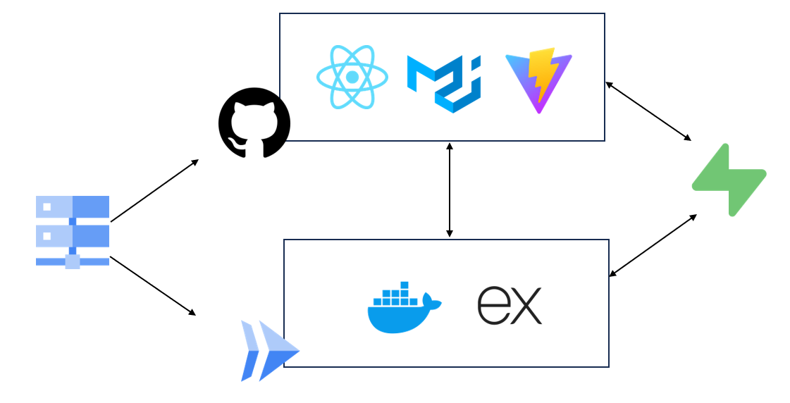

# minimart

Prototype: [https://minimart.nknguyenhc.net](https://minimart.nknguyenhc.net)

## Overall architecture

Google Cloud DNS was used to host our domain and point the respective domains to our frontend and backend servers.

Our website architecture is split into 3 parts: frontend, backend, and database. Each of the parts is deployed separately.

### Frontend

React was chosen as framework due to its ease of development and familiarity. We made use of MUI components to quickly build our frontend. Vite was used as our development server and builder. Our frontend is deployed on Github Pages.

### Backend

Our backend is built with ExpressJS, a lightweight framework allowing us to only build features we need. Our backend is Dockerised and deployed on Google Cloud Run.

### Supabase

Supabase provides us with a PostgreSQL database for us to persist our application's data. Frontend accesses the database for sign-up and login. Backend accesses the database for the rest of the application logic.

## Details

Refer to our specific readmes for more details:

* [Frontend](./frontend/README.md)
* [Backend](./backend/README.md)
* [Supabase](./supabase/README.md)
