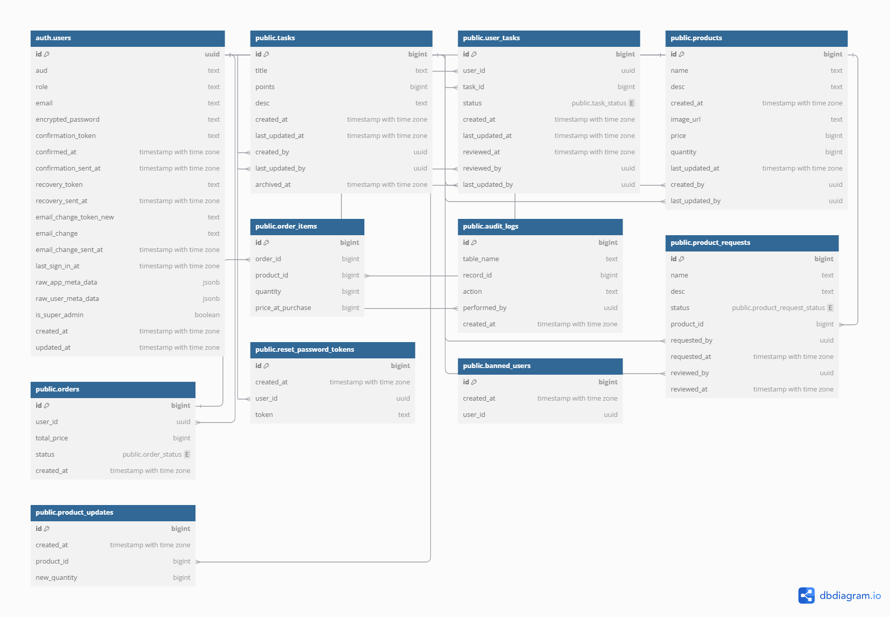

# Database

## Database Schemas



### Tasks

| Column Name   | Data Type                      | Description                                      |
|---------------|--------------------------------|--------------------------------------------------|
| id            | bigint                         | Unique identifier for each task.                 |
| title         | text                           | Title of the task.                               |
| points        | bigint                         | Points awarded for completing the task.          |
| desc          | text                           | Description of the task.                         |
| created_at    | timestamp with time zone       | Timestamp when the task was created.             |
| last_updated_at | timestamp with time zone     | Timestamp when the task was last updated.        |
| created_by    | uuid                           | User ID of the creator of the task.              |
| last_updated_by | uuid                         | User ID of the last person who updated the task. |
| archived_at   | timestamp with time zone       | Timestamp when the task was archived.            |

### User Tasks

| Column Name   | Data Type                      | Description                                      |
|---------------|--------------------------------|--------------------------------------------------|
| user_id       | uuid                           | Unique identifier for the user.                  |
| task_id       | bigint                         | Unique identifier for the task.                  |
| status        | task_status                    | Status of the task (pending, approved, rejected).|
| created_at    | timestamp with time zone       | Timestamp when the user task was created.        |
| last_updated_at | timestamp with time zone     | Timestamp when the user task was last updated.   |
| reviewed_at   | timestamp with time zone       | Timestamp when the task was reviewed.            |
| reviewed_by   | uuid                           | User ID of the reviewer.                         |
| last_updated_by | uuid                         | User ID of the last person who updated the task. |

### Products

| Column Name   | Data Type                      | Description                                      |
|---------------|--------------------------------|--------------------------------------------------|
| id            | text                           | Unique identifier for each product.              |
| name          | text                           | Name of the product.                             |
| desc          | text                           | Description of the product.                      |
| created_at    | timestamp with time zone       | Timestamp when the product was created.          |
| image_url     | text                           | URL of the product image.                        |
| price         | bigint                         | Price of the product.                            |
| quantity      | bigint                         | Quantity of the product in stock.                |
| last_updated_at | timestamp with time zone     | Timestamp when the product was last updated.     |
| created_by    | uuid                           | User ID of the creator of the product.           |
| last_updated_by | uuid                         | User ID of the last person who updated the product.|

### Orders

| Column Name   | Data Type                      | Description                                      |
|---------------|--------------------------------|--------------------------------------------------|
| id            | bigint                         | Unique identifier for each order.                |
| user_id       | uuid                           | Unique identifier for the user who placed the order. |
| total_price   | bigint                         | Total price of the order.                        |
| status        | order_status                   | Status of the order (pending, completed, cancelled). |
| created_at    | timestamp with time zone       | Timestamp when the order was created.            |

### Order Items

| Column Name   | Data Type                      | Description                                      |
|---------------|--------------------------------|--------------------------------------------------|
| id            | bigint                         | Unique identifier for each order item.           |
| order_id      | bigint                         | Unique identifier for the order.                 |
| product_id    | bigint                         | Unique identifier for the product.               |
| quantity      | bigint                         | Quantity of the product ordered.                 |
| price_at_purchase | bigint                     | Price of the product at the time of purchase.    |

### Audit Logs

| Column Name   | Data Type                      | Description                                      |
|---------------|--------------------------------|--------------------------------------------------|
| id            | bigint                         | Unique identifier for each audit log entry.      |
| table_name    | text                           | Name of the table where the action occurred.     |
| record_id     | bigint                         | Identifier of the record affected by the action. |
| action        | text                           | Action performed (e.g., created, edited, deleted). |
| performed_by  | uuid                           | User ID of the person who performed the action.  |
| created_at    | timestamp with time zone       | Timestamp when the action was logged.            |

### Product Requests

| Column Name   | Data Type                      | Description                                      |
|---------------|--------------------------------|--------------------------------------------------|
| id            | bigint                         | Unique identifier for each product request.      |
| name          | text                           | Name of the requested product.                   |
| desc          | text                           | Description of the requested product.            |
| status        | product_request_status         | Status of the request (pending, approved, rejected). |
| product_id    | bigint                         | Unique identifier for the product, if applicable.|
| requested_by  | uuid                           | User ID of the person who made the request.      |
| requested_at  | timestamp with time zone       | Timestamp when the request was made.             |
| reviewed_by   | uuid                           | User ID of the person who reviewed the request.  |
| reviewed_at   | timestamp with time zone       | Timestamp when the request was reviewed.         |

### Product Updates

| Column Name   | Data Type                      | Description                                      |
|---------------|--------------------------------|--------------------------------------------------|
| id            | bigint                         | Unique identifier for each product update.       |
| created_at    | timestamp with time zone       | Timestamp when the update was made.              |
| product_id    | bigint                         | Unique identifier for the product.               |
| new_quantity  | bigint                         | New quantity of the product after the update.    |

### Reset Password Tokens

| Column Name   | Data Type                      | Description                                      |
|---------------|--------------------------------|--------------------------------------------------|
| id            | bigint                         | Unique identifier for each reset password token. |
| created_at    | timestamp with time zone       | Timestamp when the token was created.            |
| user_id       | uuid                           | User ID associated with the token.               |
| token         | text                           | The reset password token.                        |

### Banned Users

| Column Name   | Data Type                      | Description                                      |
|---------------|--------------------------------|--------------------------------------------------|
| id            | bigint                         | Unique identifier for each banned user entry.    |
| created_at    | timestamp with time zone       | Timestamp when the user was banned.              |
| user_id       | uuid                           | User ID of the banned user.                      |

## Project Setup

### Install Dependencies

To install the necessary dependencies, run the following command:
```bash
npm install
```

### Running Supabase locally

Prerequisite:
- Install Docker Desktop and configure based on these [steps](https://supabase.com/docs/guides/local-development/cli/getting-started?queryGroups=platform&platform=windows#running-supabase-locally)

To start local database (Takes time on the first run):
```bash
npm start
```
Then access the Studio URL for Supabase UI.

To apply the new migration:
```bash
npm run reset
```

To stop the database without resetting it:
```bash
npm run stop
```

### Auto generate migration scripts from changes applied using UI:
```bash
npx supabase db diff -f <script_name>
```

## Auto generate typescript types file in BE and FE folder:
```bash
npm run genTypes
```
- Run this script when there are new changes in database schema
- Refer to [documentation](https://supabase.com/docs/guides/api/rest/generating-types) for more details

### Troubleshooting
Reference for troubleshooting: [Documentation](https://supabase.com/docs/guides/deployment/managing-environments?queryGroups=environment&environment=production#troubleshooting)